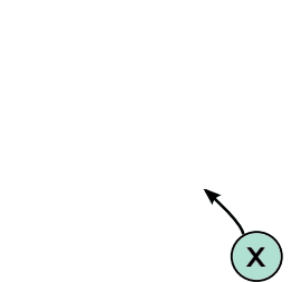
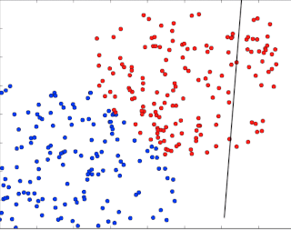
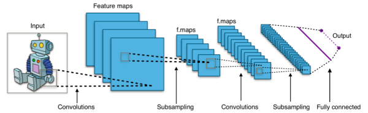

********************
`TensorFlow-Course-chinese`
********************
.. image:: https://img.shields.io/badge/contributions-welcome-brightgreen.svg?style=flat
    :target: https://github.com/open-source-for-science/TensorFlow-Course/pulls
.. image:: https://badges.frapsoft.com/os/v2/open-source.svg?v=102
    :target: https://github.com/ellerbrock/open-source-badge/

本仓库旨在为TensorFlow提供简单且即用的教程。
每个教程都有 ``源代码`` ，并且其中大部分有相关 ``文档`` 。

.. .. image:: _img/mainpage/TensorFlow_World.gif

.. The links.
.. _TensorFlow: https://www.tensorflow.org/install/
.. _Wikipedia: https://en.wikipedia.org/wiki/TensorFlow/

#################
内容列表
#################
.. contents::
  :local:
  :depth: 3

~~~~~~~~~~~~~~~~~~~~~
TensorFlow 是什么?
~~~~~~~~~~~~~~~~~~~~~
TensorFlow 是一个开源软件库，用于跨一系列任务进行数据流编程.  它是一个符号数学库，也用于机器学习应用程序，如神经网络。它被用于谷歌的研究和生产，经常替换它的闭源前身DistBelief。

TensorFlow由谷歌大脑团队开发，用于谷歌内部使用。它是在Apache 2.0开源许可协议下于2015年11月9日发布的。

截至2018年9月27日，目前的稳定版本是1.11.0

============
动机
============

这个开源项目有不同的动机。TensorFlow(在我们撰写本文时)是可用的/最好的深度学习框架之一。问题是，当网上有这么多关于TensorFlow的教程可用时，为什么还要创建这个仓库（教程）呢?

~~~~~~~~~~~~~~~~~~~~~
为什么使用TensorFlow?
~~~~~~~~~~~~~~~~~~~~~

深度学习如今风头正盛 - 因此急需对对于算法和体系结构的快速和优化实现。 TensorFlow 就是被设计用来促进这一目标。

TensorFlow的强大优势在于它在设计高度模块化模型时的灵活性，这对初学者来说也是一个缺点，因为在创建模型时，必须将许多部分考虑在一起。

这个问题在开发高级API，例如 `Keras <https://keras.io/>`_ 和 `Slim <https://github.com/tensorflow/models/blob/031a5a4ab41170d555bc3e8f8545cf9c8e3f1b28/research/inception/inception/slim/README.md>`_ 时得到了简化，因为他们抽象了机器学习算法设计中的很多部分。

关于TensorFlow有趣的是，  **如今它到处都是**. 许多研究人员和开发人员正在使用它， 并且 *它的社区以光速发展*! 许多问题都可以很容易地解决，因为有大量的人参与到TensorFlow社区中，这些问题通常与许多其他人遇到的问题相同。

~~~~~~~~~~~~~~~~~~~~~~~~~~~~~~~~~~~~
这个仓库的意义是什么?
~~~~~~~~~~~~~~~~~~~~~~~~~~~~~~~~~~~~

**开发开源项目只是为了开发一些东西，这并不是背后的原因**.
考虑到大量的教程正被加入到这个大型社区中去， 这个仓库的创建是为了打破通常发生在大多数开源项目上的“从创建到退出”的过程, **但是为什么，怎么做？**?

首先，把精力放在大多数人不会停下来看一眼的东西上有什么意义呢?创建对开发人员和研究人员社区中的任何人都没有帮助的东西有什么意义?为什么花时间在一些遗忘的东西上? 但是 **我们如何尝试去做?**即使到现在，有无数关于TensorFlow的教程，无论是关于模型设计还是TensorFlow工作流。

他们中大部分都太复杂了，或者缺少文档。只有极少数的教程是简洁且结构良好的，并且为他们的特定实现模型提供了足够的洞察力。

这个项目的目标是通过结构化教程和简单优化的代码实现帮助社区更好地了解如何 *快速且高效*的使用TensorFlow.

值得注意的是, **这个项目的主要目标是提供良好文档化的教程和不那么复杂的代码**!

=================================================
TensorFlow 安装和配置环境
=================================================

.. _TensorFlow Installation: docs/tutorials/installation

安装TensorFlow请参照以下链接:

  * `TensorFlow 安装`_

.. image:: _img/mainpage/installation.gif
    :target: https://www.youtube.com/watch?v=_3JFEPk4qQY&t=2s

建议安装虚拟环境，以防止包冲突并具有自定义工作环境的能力。

====================
TensorFlow 教程
====================

此仓库中的教程被划分为相关的类别。

==========================

~~~~~~~~
热身
~~~~~~~~

+----+---------------------+----------------------------------------------------------------------------------------+----------------------------------------------+
| #  |       主题         |   源代码                                                                          |                                              |
+====+=====================+========================================================================================+==============================================+
| 1  | Start-up            | `Welcome <welcomesourcecode_>`_  / `IPython <ipythonwelcome_>`_                        |  `Documentation <Documentationcnnwelcome_>`_ |
+----+---------------------+----------------------------------------------------------------------------------------+----------------------------------------------+

==========================

~~~~~~
基础
~~~~~~

+----+---------------------+----------------------------------------------------------------------------------------+----------------------------------------------+
| #  |       主题         |   源代码                                                                          |                                              |
+====+=====================+========================================================================================+==============================================+
| 2  | *TensorFLow Basics* | `Basic Math Operations <basicmathsourcecode_>`_   / `IPython <ipythonbasicmath_>`_     |  `Documentation <Documentationbasicmath_>`_  |
+----+---------------------+----------------------------------------------------------------------------------------+----------------------------------------------+
| 3  | *TensorFLow Basics* | `TensorFlow Variables <variablssourcecode_>`_   / `IPython <ipythonvariabls_>`_        |  `Documentation <Documentationvariabls_>`_   |
+----+---------------------+----------------------------------------------------------------------------------------+----------------------------------------------+

==========================

~~~~~~~~~~~~~~~~~~~~~~
基础机器学习
~~~~~~~~~~~~~~~~~~~~~~

+----+----------------------------+----------------------------------------------------------------------------------------+----------------------------------------------+
| #  |       主题                |   源代码                                                                        |                                              |
+====+============================+========================================================================================+==============================================+
| 4  | *Linear Models*            |`Linear Regression`_  / `IPython <LinearRegressionipython_>`_                           | `Documentation <Documentationlr_>`_          |
+----+----------------------------+----------------------------------------------------------------------------------------+----------------------------------------------+
| 5  | *Predictive Models*        | `Logistic Regression`_  / `IPython <LogisticRegressionipython_>`_                      | `Documentation <LogisticRegDOC_>`_           |
+----+----------------------------+----------------------------------------------------------------------------------------+----------------------------------------------+
| 6  | *Support Vector Machines*  | `Linear SVM`_  / `IPython <LinearSVMipython_>`_                                        |                                              |
+----+----------------------------+----------------------------------------------------------------------------------------+----------------------------------------------+
| 7  | *Support Vector Machines*  |`MultiClass Kernel SVM`_  / `IPython <MultiClassKernelSVMipython_>`_                    |                                              |
+----+----------------------------+----------------------------------------------------------------------------------------+----------------------------------------------+

==========================

~~~~~~~~~~~~~~~~
神经网络
~~~~~~~~~~~~~~~~

+----+-----------------------------------+-----------------------------------------------------------------------------------------------+----------------------------------------------+
| #  |       主题                      |   源代码                                                                                 |                                              |
+====+===================================+===============================================================================================+==============================================+
| 8  | *Multi Layer Perceptron*          |`Simple Multi Layer Perceptron`_   / `IPython <MultiLayerPerceptronipython_>`_                 |                                              |
+----+-----------------------------------+-----------------------------------------------------------------------------------------------+----------------------------------------------+
| 9  | *Convolutional Neural Network*    | `Simple Convolutional Neural Networks`_                                                       |       `Documentation <Documentationcnn_>`_   |
+----+-----------------------------------+-----------------------------------------------------------------------------------------------+----------------------------------------------+
| 10 | *Autoencoder*                     | `Undercomplete Autoencoder <udercompleteautoencodercode_>`_                                   |       `Documentation <Documentationauto_>`_  |
+----+-----------------------------------+-----------------------------------------------------------------------------------------------+----------------------------------------------+
| 11 | *Recurrent Neural Network*        | `RNN`_  / `IPython <RNNIpython_>`_                                                            |                                              |
+----+-----------------------------------+-----------------------------------------------------------------------------------------------+----------------------------------------------+

.. ~~~~~~~~~~~~
.. **Welcome**
.. ~~~~~~~~~~~~

.. The tutorial in this section is just a simple entrance to TensorFlow.

.. _welcomesourcecode: codes/0-welcome
.. _Documentationcnnwelcome: docs/tutorials/0-welcome
.. _ipythonwelcome: codes/0-welcome/code/0-welcome.ipynb

.. +---+---------------------------------------------+-------------------------------------------------+
.. | # |          Source Code                        |                                                 |
.. +===+=============================================+=================================================+
.. | 1 |    `Welcome <welcomesourcecode_>`_          |  `Documentation <Documentationcnnwelcome_>`_    |
.. +---+---------------------------------------------+-------------------------------------------------+

.. ~~~~~~~~~~
.. **Basics**
.. ~~~~~~~~~~
.. These tutorials are related to basics of TensorFlow.

.. _basicmathsourcecode: codes/1-basics/basic_math_operations
.. _Documentationbasicmath: docs/tutorials/1-basics/basic_math_operations
.. _ipythonbasicmath: codes/1-basics/basic_math_operations/code/basic_math_operation.ipynb

.. _ipythonvariabls: codes/1-basics/variables/code/variables.ipynb
.. _variablssourcecode: codes/1-basics/variables/README.rst
.. _Documentationvariabls: docs/tutorials/1-basics/variables

.. +---+-----------------------------------------------------+-------------------------------------------------+
.. | # |          Source Code                                |                                                 |
.. +===+=====================================================+=================================================+
.. | 1 |    `Basic Math Operations <basicmathsourcecode_>`_  |  `Documentation <Documentationbasicmath_>`_     |
.. +---+-----------------------------------------------------+-------------------------------------------------+
.. | 2 |    `TensorFlow Variables <variablssourcecode_>`_    |  `Documentation <Documentationvariabls_>`_      |
.. +---+-----------------------------------------------------+-------------------------------------------------+

.. ~~~~~~~~~~~~~~~~~~~~~~~~~~~~
.. **Machine Learning Basics**
.. ~~~~~~~~~~~~~~~~~~~~~~~~~~~~
.. We are going to present concepts of basic machine learning models and methods and show how to implement them in Tensorflow.

.. _Linear Regression: codes/2-basics_in_machine_learning/linear_regression
.. _LinearRegressionipython: codes/2-basics_in_machine_learning/linear_regression/code/linear_regression.ipynb
.. _Documentationlr: docs/tutorials/2-basics_in_machine_learning/linear_regression

.. _Logistic Regression: codes/2-basics_in_machine_learning/logistic_regression
.. _LogisticRegressionipython: codes/2-basics_in_machine_learning/logistic_regression/code/logistic_regression.ipynb
.. _LogisticRegDOC: docs/tutorials/2-basics_in_machine_learning/logistic_regression

.. _Linear SVM: codes/2-basics_in_machine_learning/linear_svm
.. _LinearSVMipython: codes/2-basics_in_machine_learning/linear_svm/code/linear_svm.ipynb

.. _MultiClass Kernel SVM: codes/2-basics_in_machine_learning/multiclass_svm
.. _MultiClassKernelSVMipython: codes/2-basics_in_machine_learning/multiclass_svm/code/multiclass_svm.ipynb

.. +---+---------------------------------------------+----------------------------------------+
.. | # |          Source Code                        |                                        |
.. +===+=============================================+========================================+
.. | 1 |    `Linear Regression`_                     |  `Documentation <Documentationlr_>`_   |
.. +---+---------------------------------------------+----------------------------------------+
.. | 2 |    `Logistic Regression`_                   |  `Documentation <LogisticRegDOC_>`_    |
.. +---+---------------------------------------------+----------------------------------------+
.. | 3 |    `Linear SVM`_                            |                                        |
.. +---+---------------------------------------------+----------------------------------------+
.. | 4 |    `MultiClass Kernel SVM`_                 |                                        |
.. +---+---------------------------------------------+----------------------------------------+

.. ~~~~~~~~~~~~~~~~~~~
.. **Neural Networks**
.. ~~~~~~~~~~~~~~~~~~~
.. The tutorials in this section are related to neural network architectures.

.. _Simple Convolutional Neural Networks: codes/3-neural_networks/convolutional-neural-network
.. _Documentationcnn: docs/tutorials/3-neural_network/convolutiona_neural_network

.. _Simple Multi Layer Perceptron: codes/3-neural_networks/multi-layer-perceptron
.. _MultiLayerPerceptronipython: codes/3-neural_networks/multi-layer-perceptron/code/train_mlp.ipynb

.. _udercompleteautoencodercode: codes/3-neural_networks/undercomplete-autoencoder
.. _Documentationauto: docs/tutorials/3-neural_network/autoencoder

.. _RNN: codes/3-neural_networks/recurrent-neural-networks/code/rnn.py
.. _RNNIpython: codes/3-neural_networks/recurrent-neural-networks/code/rnn.py

.. +---+---------------------------------------------+----------------------------------------+
.. | # |          Source Code                        |                                        |
.. +===+=============================================+========================================+
.. | 1 |    `Multi Layer Perceptron`_                |                                        |
.. +---+---------------------------------------------+----------------------------------------+
.. | 2 |    `Convolutional Neural Networks`_         |  `Documentation <Documentationcnn_>`_  |
.. +---+---------------------------------------------+----------------------------------------+

=====================
一些有用的教程
=====================

  * `TensorFlow Examples <https://github.com/aymericdamien/TensorFlow-Examples>`_ - 为初学者提供的TensorFlow教程和代码示例 
  * `Sungjoon's TensorFlow-101 <https://github.com/sjchoi86/Tensorflow-101>`_ -  使用Jupyter Notebook用python编写的TensorFlow教程
  * `Terry Um’s TensorFlow Exercises <https://github.com/terryum/TensorFlow_Exercises>`_ - 使用其他TensorFlow示例重新编写的代码
  * `Classification on time series <https://github.com/guillaume-chevalier/LSTM-Human-Activity-Recognition>`_ - 用LSTM对手机传感器数据进行递归神经网络分类

=============
贡献
=============

在对这个仓库进行贡献时，请首先讨论您希望进行的更改，通过提交issue，email，或者其他方式，在提交更改之前与仓库的所有者进行联系。*对于拼写错误，请不要创建pull request。 相反的，可以在issue中声明，或给仓库所有者发email*.

请注意我们有一套代码准则，请在项目的所有互动中遵循它。

~~~~~~~~~~~~~~~~~~~~
Pull 请求过程
~~~~~~~~~~~~~~~~~~~~

为了更好的帮助我们，请考虑以下标准:

  * pull 请求主要希望是一个代码脚本建议或改进。
  * 与非代码脚本部分相关的pull请求希望是对文档的显著改变。否则，最好在issue提交。
  * 在进行构建和创建pull请求时，确保在层结束之前删除任何安装或构建依赖项。
  * 添加提交时带有接口更改的详细信息，包括新的环境变量、公开的端口、有用的文件位置和容器参数。
  * 您可以合并Pull请求，一旦您获得至少一个其他开发人员的签名，或者如果您没有这样做的权限，您可以请求所有者为您合并它，如果您认为所有检查都通过了。

~~~~~~~~~~~
最后的注意点
~~~~~~~~~~~

我们期待您的反馈。 请帮助我们提升这个开源项目，使我们的工作做得更好。
对于贡献，请创建一个pull请求，我们会立即进行调查。我们再次表示感谢
您友好的反馈和详细的代码检查。

================
感谢
================

我在这个项目中付出了巨大的努力，希望成为TensorFlow世界的一小部分。然而，这是不可能的做到的如果没有我的朋友和同事的支持和帮助， `Domenick Poster <https://github.com/vonclites/>`_ 提供了宝贵的意见。 他帮助我更好地理解了TensorFlow，我特别感谢他。
我同样要感谢 `Hadi Kazemi <http://www.hadikazemi.com/>`_ 为他在开发  `Undercomplete Autoencoders Tutorial <docs/tutorials/3-neural_network/autoencoder>`_ 时所做的贡献。
