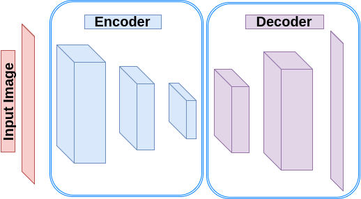

自动编码器及其在TensorFlow中的实现
----------------------------------------------------

在这篇文章中，你会学习到自动编码背后的概念，以及如何使用TensorFlow实现自动编码。

介绍
------------

自动编码器是一种将其输入映射到输出的神经网络。它们通常由两个主要部分组成，即编码器和
译码器。 编码器将输入映射到隐藏层空间，此处的输入是代码。然后译码器重新构造输入的代码。有不同种类的自动编码器： 

-   **Undercomplete Autoencoders:**一种自动编码器，输出代码维数小于输入维数。 学习这样的自动编码器迫使它捕捉最显著的特征。
    然而，使用一个很大的编码器和译码器，在缺少足够的训练数据的情况下，会使网络记住任务本身，而忽略
    学习有用的特征。（过拟合？）在线性译码器的情况下，可以以PCA的形式运作。然而，添加非线性的激活函数，使其成为PCA的非线性推广。 
-   **正则自编码器:** 我们可以用加一个损失函数的方法去避免模型记住任务和训练数据，而不是限制自编码器的规模和特征学习中的代码维度。
     -   **稀疏自编码器:**一个编码器，除了重构误差外，在训练过程中还存在稀疏性损失。他们通常用于负责其他任务，例如分类。 损失不像其他正则化（？）一样直白，我们稍后
     会在其他文章讨论。  
     -   **降噪自编码器 (DAE):** DAE的输入是真实的输入加上了干扰项，需要被重建。因此，DAE在重建的过程中需要去除干扰噪声。 
     -   **Contractive Autoencoders (CAE):** 这些类型的自动编码器背后的主要思想是学习到输入变量的细小改变，并对其具有鲁棒性。
-   **Variational Autoencoders:** 他们最大化了训练数据的概率，而不是将输入映射到输出，因此不需要正则化来获取有效信息。

在这篇文章中，我们要在TensorFlow中创建一个简单的Undercomplete Autoencoder（不完全自编码器？）
，去学习一个低维度的MNIST数据集（一个手写数字图片库）表现。

创建一个Undercomplete Autoencoder
-----------------------------------

我们要创建一个有三层编码器三层译码器的自编码器。 Each layer of encoder downsamples its input along the spatial
dimensions (width, height) by a factor of two using a stride 2.
因此代码的维度是2（宽）×2（高）×8（深）=32（对于一张照片 32×32）。 Similarly, each layer of the
decoder upsamples its input by a factor of two (using transpose
convolution with stride 2).

.. code-block:: python

    import tensorflow.contrib.layers as lays

    def autoencoder(inputs):
        # encoder
        # 32 file code blockx 32 x 1   ->  16 x 16 x 32
        # 16 x 16 x 32  ->  8 x 8 x 16
        # 8 x 8 x 16    ->  2 x 2 x 8
        net = lays.conv2d(inputs, 32, [5, 5], stride=2, padding='SAME')
        net = lays.conv2d(net, 16, [5, 5], stride=2, padding='SAME')
        net = lays.conv2d(net, 8, [5, 5], stride=4, padding='SAME')
        # decoder
        # 2 x 2 x 8    ->  8 x 8 x 16
        # 8 x 8 x 16   ->  16 x 16 x 32
        # 16 x 16 x 32  ->  32 x 32 x 1
        net = lays.conv2d_transpose(net, 16, [5, 5], stride=4, padding='SAME')
        net = lays.conv2d_transpose(net, 32, [5, 5], stride=2, padding='SAME')
        net = lays.conv2d_transpose(net, 1, [5, 5], stride=2, padding='SAME', activation_fn=tf.nn.tanh)
        return net

   **Figure 1:** Autoencoder

MNIST数据集采用了28X28的矢量化图片。因此我们定义一个新的方程去重塑每一批次的MINST图片，把28×28的图片，变为32×32的。 
变成32×32的原因是，使之成为2的幂，便于我们下采样和上采样。

.. code-block:: python

    import numpy as np
    from skimage import transform

    def resize_batch(imgs):
        # A function to resize a batch of MNIST images to (32, 32)
        # Args:
        #   imgs: a numpy array of size [batch_size, 28 X 28].
        # Returns:
        #   a numpy array of size [batch_size, 32, 32].
        imgs = imgs.reshape((-1, 28, 28, 1))
        resized_imgs = np.zeros((imgs.shape[0], 32, 32, 1))
        for i in range(imgs.shape[0]):
            resized_imgs[i, ..., 0] = transform.resize(imgs[i, ..., 0], (32, 32))
        return resized_imgs

现在我们创造了一个自动编码器，定义了一个平方误差和一个优化器。

.. code-block:: python

    import tensorflow as tf

    ae_inputs = tf.placeholder(tf.float32, (None, 32, 32, 1))  # input to the network (MNIST images)
    ae_outputs = autoencoder(ae_inputs)  # create the Autoencoder network

    # calculate the loss and optimize the network
    loss = tf.reduce_mean(tf.square(ae_outputs - ae_inputs))  # claculate the mean square error loss
    train_op = tf.train.AdamOptimizer(learning_rate=lr).minimize(loss)

    # initialize the network
    init = tf.global_variables_initializer()

现在我们读取一批次的图片，训练网络并最终测试网络，通过重建一批次的图片。

.. code-block:: python

    from tensorflow.examples.tutorials.mnist import input_data

    batch_size = 500  # Number of samples in each batch
    epoch_num = 5     # Number of epochs to train the network
    lr = 0.001        # Learning rate

    # read MNIST dataset
    mnist = input_data.read_data_sets("MNIST_data", one_hot=True)

    # calculate the number of batches per epoch
    batch_per_ep = mnist.train.num_examples // batch_size

    with tf.Session() as sess:
        sess.run(init)
        for ep in range(epoch_num):  # epochs loop
            for batch_n in range(batch_per_ep):  # batches loop
                batch_img, batch_label = mnist.train.next_batch(batch_size)  # read a batch
                batch_img = batch_img.reshape((-1, 28, 28, 1))               # reshape each sample to an (28, 28) image
                batch_img = resize_batch(batch_img)                          # reshape the images to (32, 32)
                _, c = sess.run([train_op, loss], feed_dict={ae_inputs: batch_img})
                print('Epoch: {} - cost= {:.5f}'.format((ep + 1), c))

        # test the trained network
        batch_img, batch_label = mnist.test.next_batch(50)
        batch_img = resize_batch(batch_img)
        recon_img = sess.run([ae_outputs], feed_dict={ae_inputs: batch_img})[0]

        # plot the reconstructed images and their ground truths (inputs)
        plt.figure(1)
        plt.title('Reconstructed Images')
        for i in range(50):
            plt.subplot(5, 10, i+1)
            plt.imshow(recon_img[i, ..., 0], cmap='gray')
        plt.figure(2)
        plt.title('Input Images')
        for i in range(50):
            plt.subplot(5, 10, i+1)
            plt.imshow(batch_img[i, ..., 0], cmap='gray')
        plt.show()
